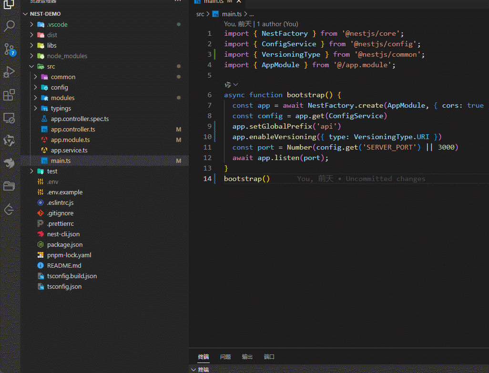

# Nestjs Route Jumper

English | [简体中文](./README.zh_CN.md)

A plugin provided for the Nestjs project to quickly jump to code blocks through interface addresses.

By querying the access path for matching Controllers and Methods, it is possible to jump to the corresponding function definition.

## Visual Studio Marketplace

This extension is available on the [Visual Studio Marketplace](https://marketplace.visualstudio.com/items?itemName=hmydgz.nestjs-route-jumper) for Visual Studio Code.
